# GoQuorum — Architecture Diagrams

Mermaid diagrams at every C4 level, plus sequence and state diagrams.

---

## 1. C4 Level 1 — System Context

Who interacts with GoQuorum and what external systems it touches.

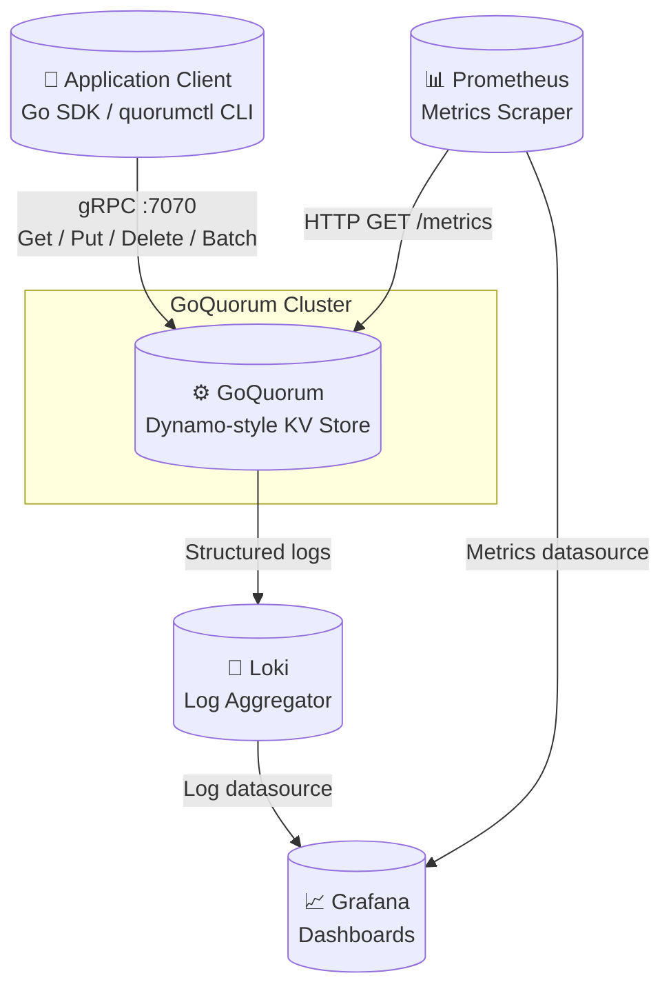

---

## 2. C4 Level 2 — Container Diagram

Deployable units inside a single GoQuorum node.

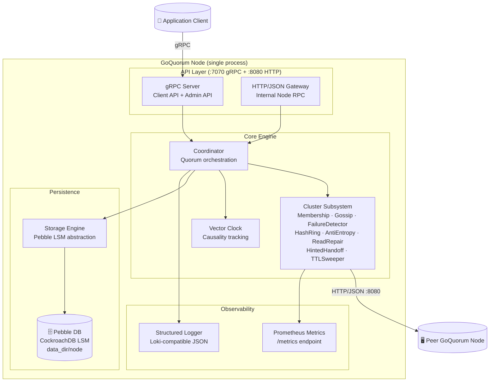

---

## 3. C4 Level 3 — Component Diagram

Internal components and their wiring inside the GoQuorum node process.

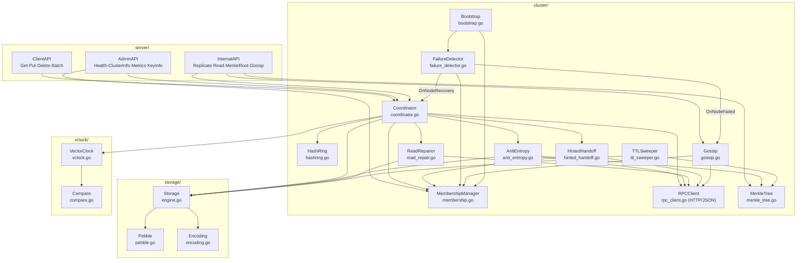

---

## 4. Sequence — Client Write (Put) with Quorum

Full path for a `Put` call from client to quorum acknowledgement.

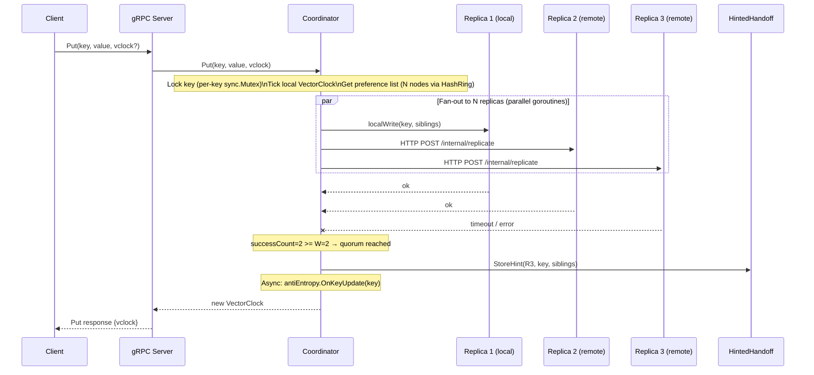

---

## 5. Sequence — Client Read (Get) with Read Repair

Full path for a `Get` including sibling merging and probabilistic read repair.

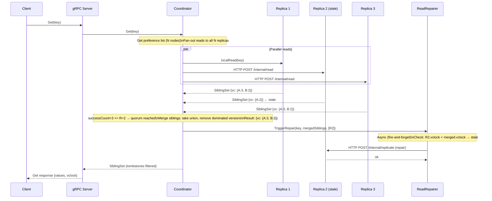

---

## 6. Sequence — Anti-Entropy Merkle Sync

Background divergence detection and repair between two nodes.

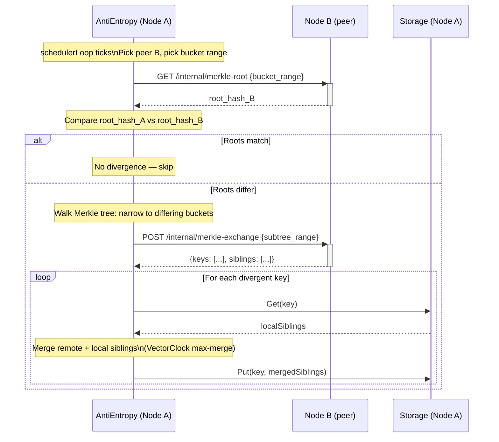

---

## 7. Sequence — Node Recovery via Hinted Handoff

A previously failed node comes back online and receives buffered writes.

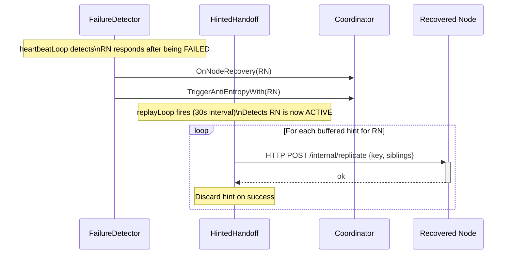

---

## 8. State Diagram — Node Lifecycle

State transitions a peer node goes through from the perspective of a monitoring node.

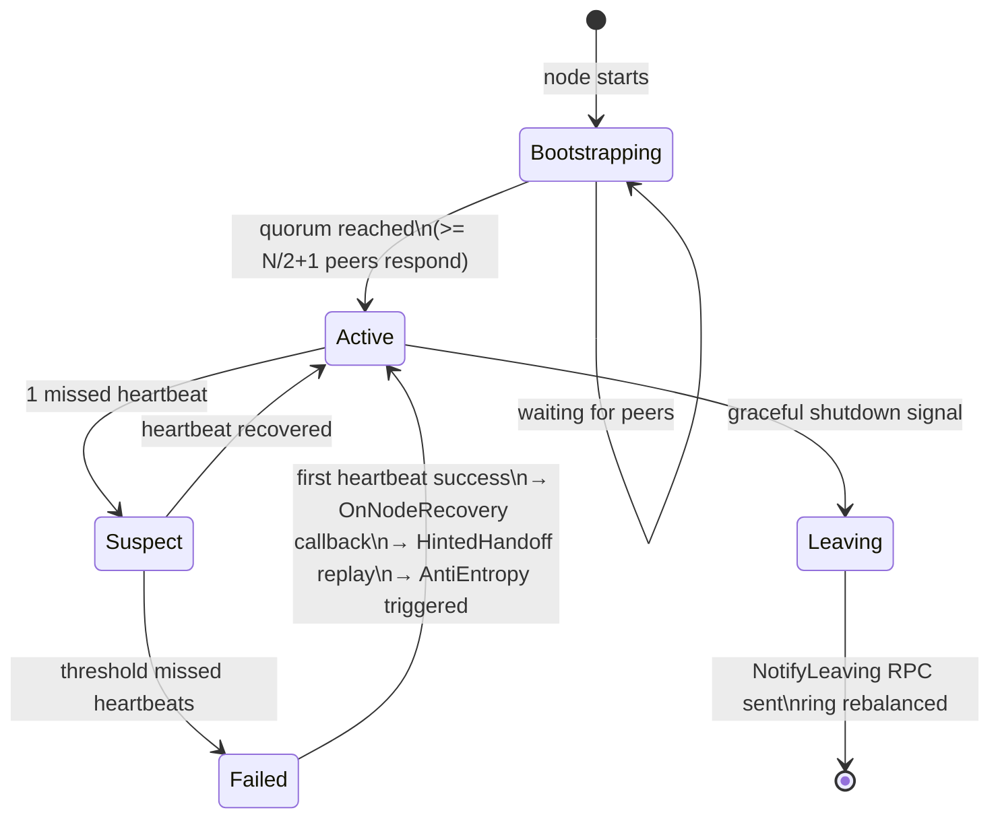

---

## 9. Flowchart — Consistent Hashing Key Lookup

How a key maps to its N replica nodes via the virtual-node ring.

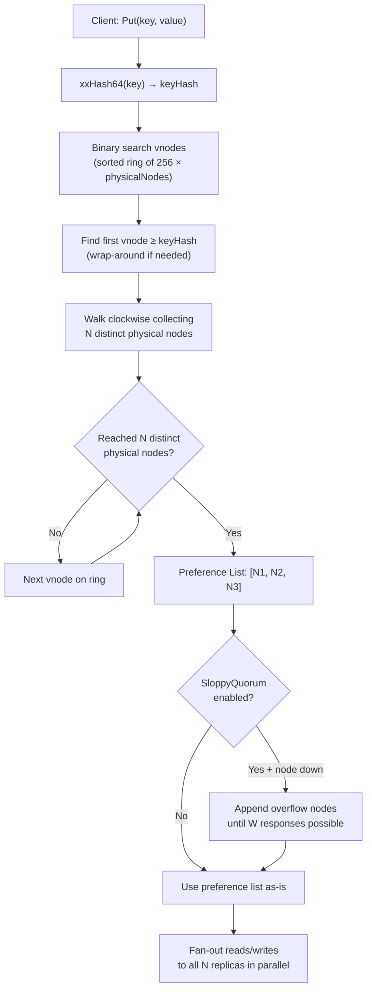

---

## 10. Flowchart — Write Quorum Evaluation

Decision logic inside `Coordinator.Put` after fan-out.

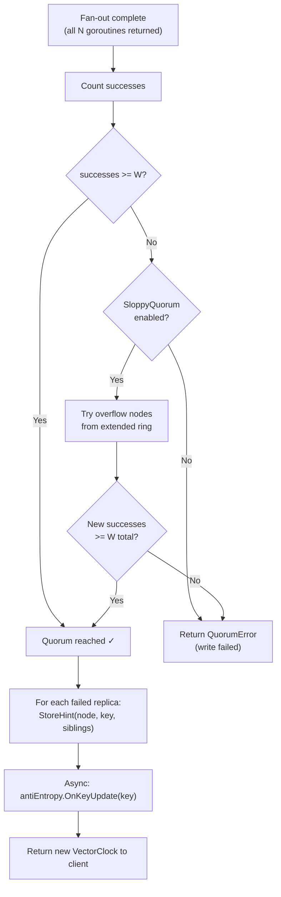

---

---

## 11. Class Diagram — Core Domain Types

Relationships between the main data structures across `vclock/`, `storage/`, and `common/`.

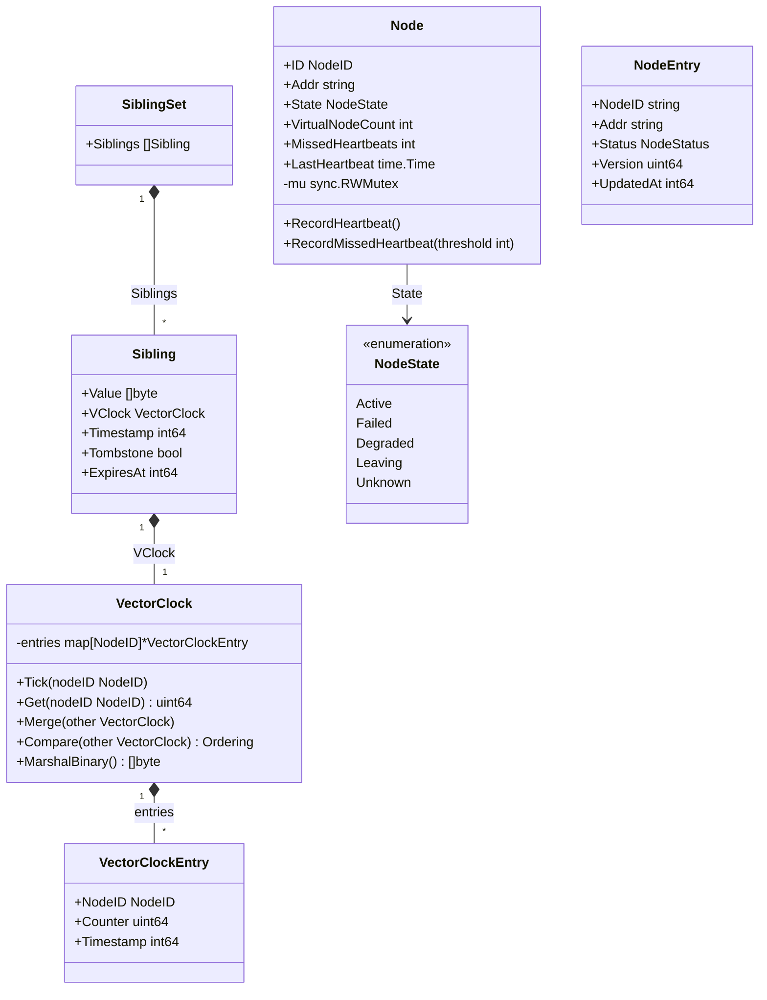

---

## 12. Class Diagram — Coordinator & Cluster Wiring

How the main cluster structs hold references to each other (dependency graph as types).

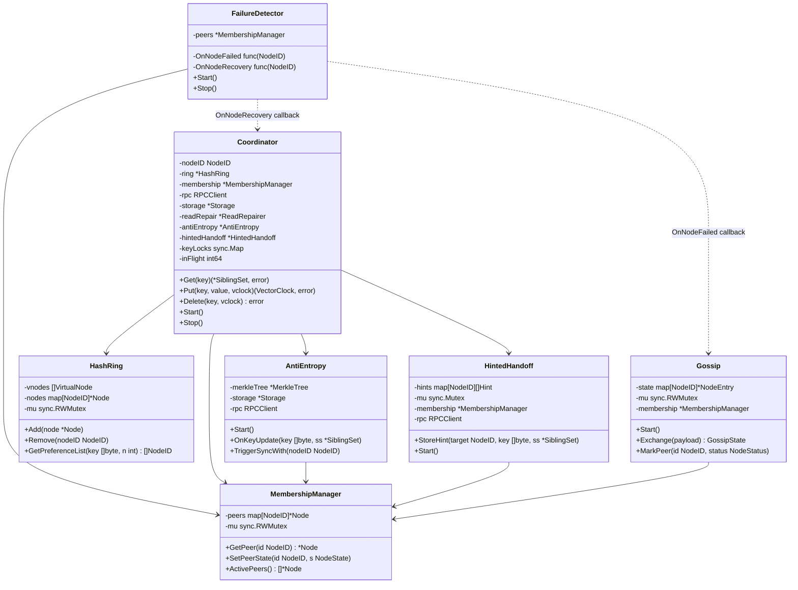

---

## 13. Sequence — Gossip Push-Pull Exchange

How membership state propagates between nodes using last-write-wins versioning.

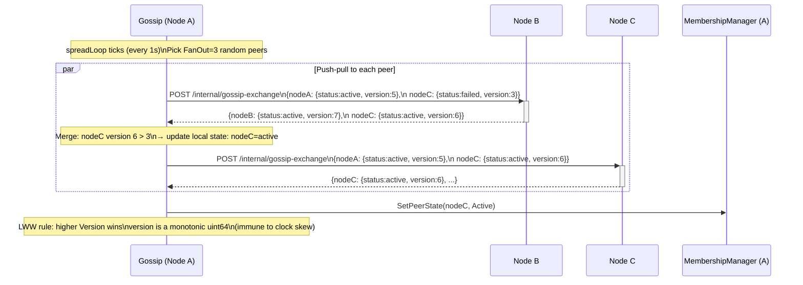

---

## 14. Flowchart — Binary Sibling Encoding (Pebble Value Format)

How a `SiblingSet` is serialised to bytes before writing to Pebble.

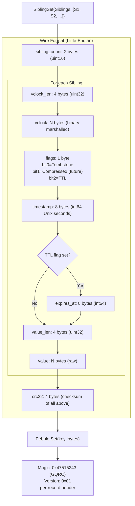

---

## 15. State Diagram — Key Lifecycle (TTL & Tombstones)

The full lifecycle of a key from write through expiry, tombstone, and GC.

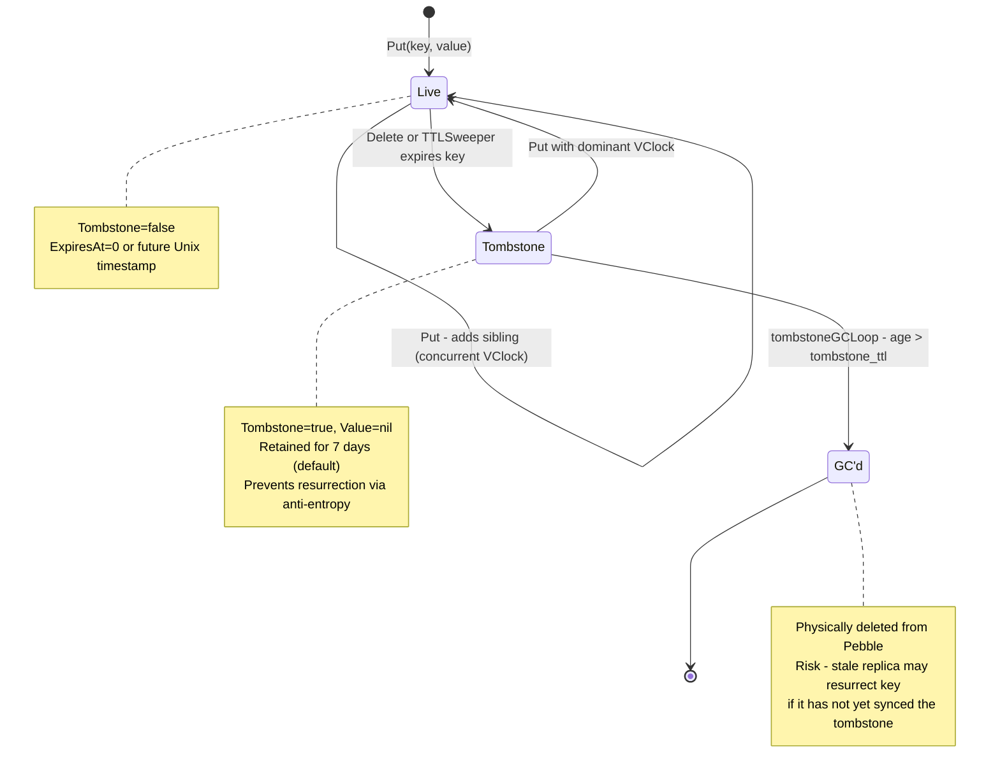

---

## 16. Sequence — Node Bootstrap (Startup Sequence)

The ordered initialisation of all subsystems in `cmd/quorum/main.go`.

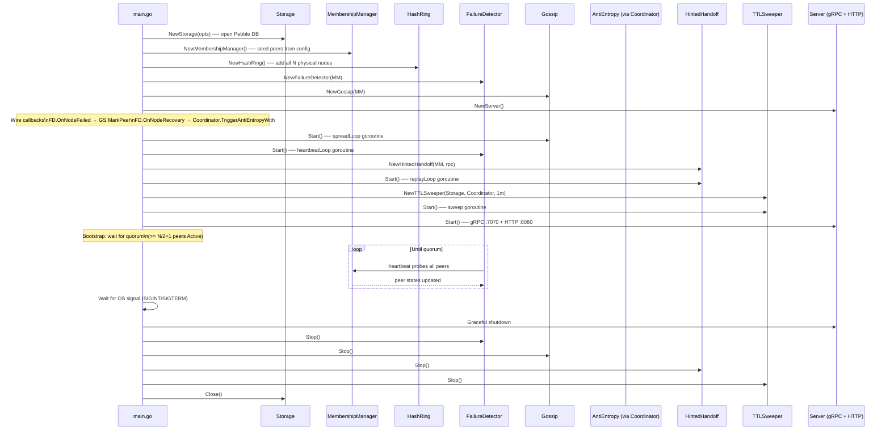

---

## 17. Flowchart — Per-Key Write Concurrency

How the Coordinator serialises concurrent writes to the same key while keeping cross-key parallelism.

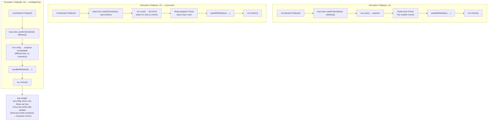

---

## 18. Flowchart — Quorum Consistency Tradeoff

How N, R, W choices affect consistency guarantees and availability.

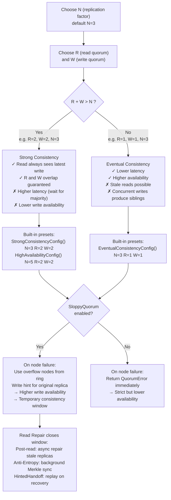

---

## Diagram Index

| # | Title | Type | Key Insight |
|---|-------|------|-------------|
| 1 | System Context | C4-L1 | External actors: clients, Prometheus, Loki, Grafana |
| 2 | Container | C4-L2 | Two protocols: gRPC :7070 (clients), HTTP :8080 (inter-node) |
| 3 | Component | C4-L3 | 12 cluster components; FailureDetector wires via callbacks |
| 4 | Client Write | Sequence | Parallel fan-out → quorum count → HintedHandoff on failure |
| 5 | Client Read | Sequence | Merge siblings → R quorum → probabilistic read repair |
| 6 | Anti-Entropy | Sequence | Merkle root compare → narrow subtree → key-level merge |
| 7 | Node Recovery | Sequence | FD callback → HintedHandoff replay → AntiEntropy sync |
| 8 | Node Lifecycle | State | Bootstrapping → Active → Degraded → Failed → Active |
| 9 | Key Lookup | Flowchart | xxHash → binary search → clockwise walk → sloppy overflow |
| 10 | Write Quorum | Flowchart | W threshold → sloppy fallback → hint store → VClock return |
| 11 | Core Domain Types | Class | VectorClock → VectorClockEntry; Sibling → SiblingSet |
| 12 | Cluster Wiring | Class | Coordinator owns ring/membership/AE/HH; FD wired via callbacks |
| 13 | Gossip Exchange | Sequence | Push-pull LWW merge; version-based (clock-skew immune) |
| 14 | Binary Encoding | Flowchart | Per-sibling: vclock_len·vclock·flags·timestamp·value + CRC32 |
| 15 | Key Lifecycle | State | Live → Tombstone → GC'd; resurrection risk if tombstone GC too early |
| 16 | Bootstrap Sequence | Sequence | Ordered subsystem init → quorum wait → ready |
| 17 | Per-Key Concurrency | Flowchart | sync.Map per-key mutex: same-key serialised, cross-key parallel |
| 18 | Quorum Tradeoff | Flowchart | R+W>N=strong; R+W≤N=eventual; sloppy quorum bridges failures |
